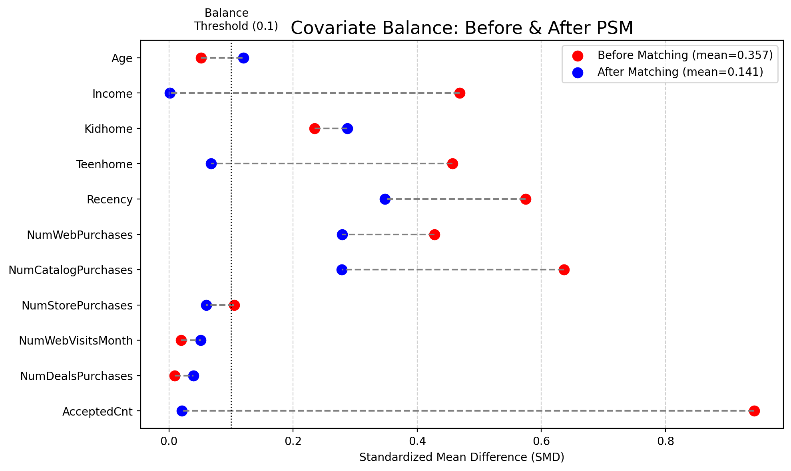
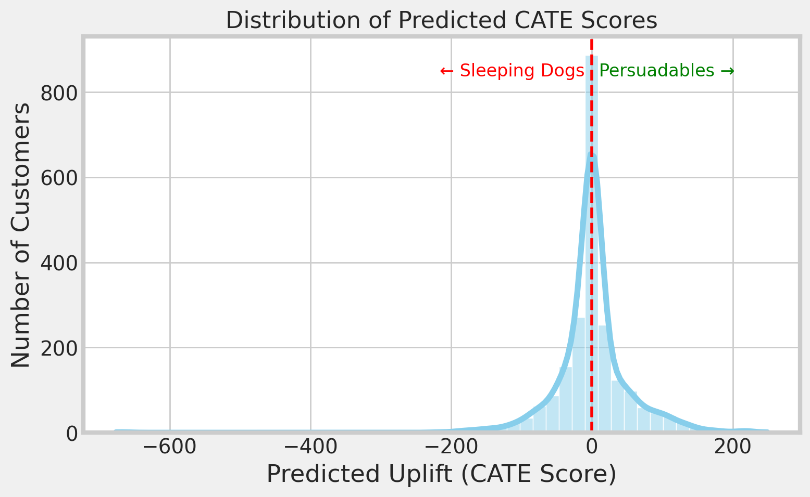
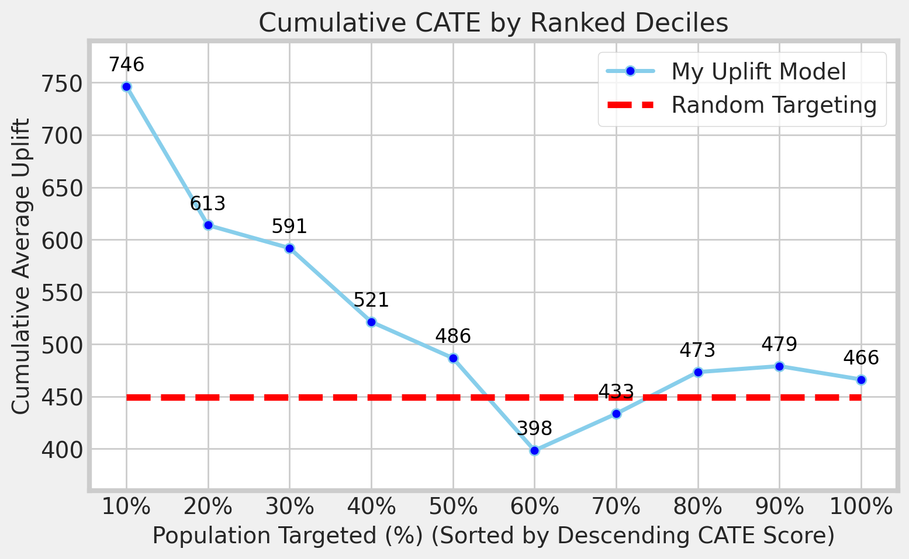

# Marketing Campaign Effectiveness Analysis

## Goal
Measure and validate the true effectiveness of a marketing campaign beyond raw response counts.

---

## Data
[Marketing Campaign Dataset](https://www.kaggle.com/datasets/rodsaldanha/arketing-campaign)
- Customer demographics: age, income, household with kids, etc.  
- Marketing history: prior campaign acceptance (aggregated features)  
- Spending behavior: Total Spend (key performance indicator)  

---

## Methods
- Feature Engineering: Created response features via one-hot encoding & aggregation  
- Statistical Testing: Conducted Welch’s t-test, validated consistency with a Bayesian A/B test  
- Causal Inference: Applied Propensity Score Matching (11 covariates, 334 matched pairs)  
  - Explored Caliper adjustment  
  - Compared methodologies: Logistic Regression vs. XGBoost  
- Covariate Balance: Evaluated with Standardized Mean Differences (SMD) and proposed refinements  
- Uplift Modeling: Estimated CATE (Conditional Average Treatment Effect) to identify persuadable customers  

---

## Results

### Statistical Tests
- Significant campaign effect: t = 10.87, p ≈ 0.0  
- Bayesian posterior estimates aligned with frequentist results → confirms robustness  
- ATT = 228.76 after controlling for confounders  

### Propensity Score Matching (SMD)
- Identified high-imbalance features (e.g., `AcceptedCnt`)  
- SMD improvements:  
  - Base: 0.186  
  - With Caliper: 0.168  
  - With XGBoost: 0.141  
- Some features remain hard to match  
- SMD Before & After (with XGBoost)


### Uplift Model
- Predicted CATE scores (Top 5):  
  ```text
  [-72.47, -9.18, 43.36, 5.91, 53.13]

- **Distribution of Predicted CATE Scores:**
  Customers with positive uplift (Persuadables) are clear on the right tail, while negative uplift (Sleeping Dogs) appear on the left. This highlights which segments benefit from targeting and which should be excluded.


<br>
- **Cumulative Uplift Curve:**
  Targeting the top 10–30% of customers ranked by uplift score yields significantly higher gains compared to random targeting (e.g., ~746 vs. ~450). Beyond ~60%, returns diminish and performance can fall below random, suggesting optimal targeting thresholds.



---
### Key Takeaways
- Campaign demonstrated statistical and causal effectiveness.
- PSM with caliper and advanced models improved balance, though challenges remained for certain features.
- Uplift modeling provided insights into customer heterogeneity, highlighting which customers are most persuadable.
